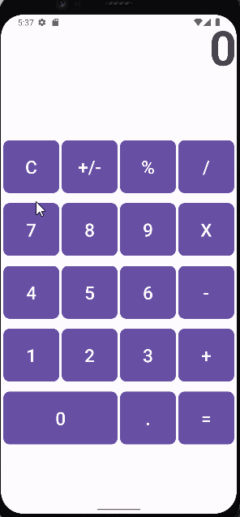

Calculator
An Android application that performs basic operations between two operands.
## Functionality
The following **required** functionality is completed:
* [X] User sees a button layout and text box
* [X] User can input one or more numbers and calculate a given operation
* [X] User can use both whole and decimal numbers
* [X] User can use operations on results of operation calculated prior
* [X] User is warned with an Error if there is an attempt to divide by 0
      
The following **extensions** are implemented:
* viewBinding
* android.os.Bundle
* android.util.Log
* androidx.activity.enableEdgetoEdge
* androidx.appcompat.app.AppCompatActivity
## Video Walkthrough
Here's a walkthrough of implemented user stories:

GIF created with [LiceCap](http://www.cockos.com/licecap/).
## Notes
* Encountered problems when trying to display non-decimal numbers when the output was whole
* Workarounds when attempting type-casting
## License
Copyright [2024] [Garrett Miller]
Licensed under the Apache License, Version 2.0 (the "License");
you may not use this file except in compliance with the License.
You may obtain a copy of the License at
http://www.apache.org/licenses/LICENSE-2.0
Unless required by applicable law or agreed to in writing, software
distributed under the License is distributed on an "AS IS" BASIS,
WITHOUT WARRANTIES OR CONDITIONS OF ANY KIND, either express or implied.
See the License for the specific language governing permissions and
limitations under the License.
